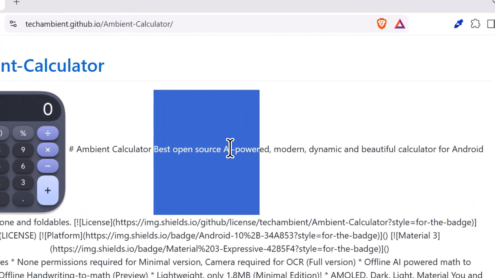
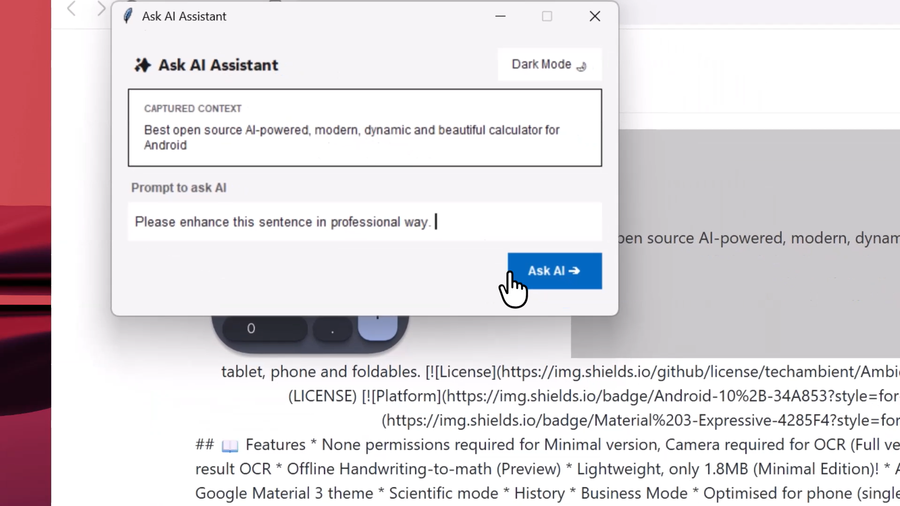
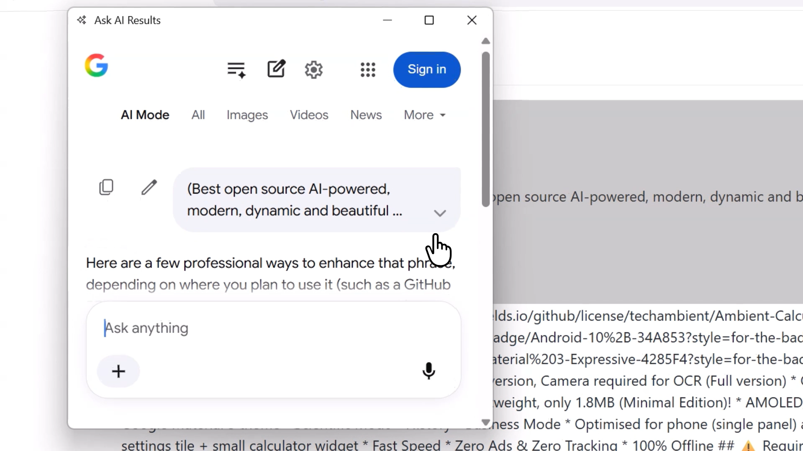

# AI Text Asker
Select text, press Win+/ on your keyboard and ask with Gemini / Google AI!! 

## 📖 Features

* None permissions required 
* Select and ask any **text** on screen
* Select and improve **sentence** on screen
* Search anything with **Gemini AI**
* Fast Speed
* Zero Ads & Zero Tracking

## ⚠️ Requirements

* Windows 10+ (Windows 11 Highly Recommended)
* Minimum 5 MB of free RAM space
* Minimum 30 MB of free disk space
* SSD / SSHD and DDR3+ RAM Highly Recommended

## 📷 Steps to use & Screenshots

**[Click here to view full demo in video](https://youtu.be/LK5na74Y964)**
  

 <i>Step 1: Select text on screen.</i> 

 <i>Step 2: Prompt to ask AI about the text.</i> 

 <i>Step 3: Sit back and relax for Google AI to respond. </i> 

## 🧑‍💻 Source Code
* You can view source code [at here](https://techambient.github.io/AI-Text-Asker/source). 

## ☕ Support

If you like this project, kindly star this repo as basic support and give feedback to help keep it alive!

* **Feedback Form:** [https://forms.gle/Z95dWsFZ4mmfJH387](https://forms.gle/Z95dWsFZ4mmfJH387)

## 💬 Join My Discord Server

Join my discord server at <a href="https://discord.gg/ATnXUUnS">
  Click Here To Join my Discord server
</a>! 

## 🔨 Contributing

Pull requests are strongly recommended. For major changes, please open an issue first to discuss what you would like to change.

## 🌎 Translations

You can help translate AI Text Asker by using this repo codes. 

## 📜 License

This project is licensed under [GPL-v3](/LICENSE)
